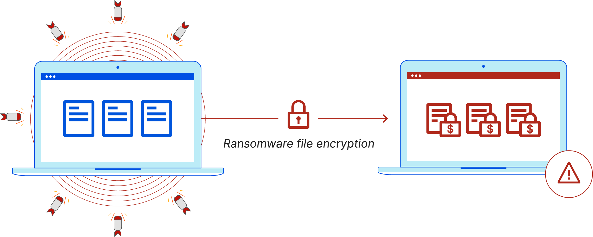

# Ransomware

Ransomware is a malware designed to deny a user or organization access to files on their computer.



## Overview

<b>This project consists of two components: `enc.py` and `dec.py`.</b>

- <b>enc.py</b> is a script that encrypts all files in a specified directory using the Fernet encryption algorithm from the `cryptography` library. Encrypted files are saved with the same name and location as the original files, and the encryption key is stored in a file named `key.key` in the same directory as the script.

- <b>dec.py</b> is a script that decrypts files encrypted by the `enc.py` script using the Fernet symmetric encryption algorithm from the `cryptography` library. The script takes a directory path as an argument and recursively searches for encrypted files in the directory and its subdirectories. It then reads the encryption key from the `key.key` file in the current directory and uses it to decrypt each file. The decrypted files are saved in place of the original encrypted files.

## Installation

Clone this repository:

```
git clone https://github.com/gabrielm3/Ransomware.curl.git
```

Navigate to the project directory:

```
cd Ransomware.curl
```

## Usage

### Encrypting Files (enc.py)

To encrypt files, you can use the 'enc.py' script. This script encrypts all files in a specified directory and saves the encryption key in the 'key.key' file. The basic usage is as follows:

```
python enc.py [directory]
```

    [directory] (optional): the directory that contains the files to be encrypted. The default is 'files' if not provided.

### Decrypting Files (dec.py)

To decrypt files encrypted by the 'enc.py' script, you can use the 'dec.py' script. This script recursively searches for encrypted files and decrypts them using the encryption key from the 'key.key' file. The basic usage is as follows:
```
python dec.py [directory_path]
```

    [directory_path] (optional): The path to the directory containing the encrypted files. If not provided, the script will use the 'files' directory in the current directory as the default.

## Contribution

Contributions are welcome! If you find a bug or have an improvement, feel free to open an issue or submit a pull request.

## License

This project is licensed under the MIT License. See the LICENSE file for details.
